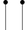
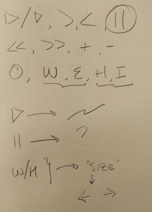

##User Interface Design (COMSW4170)
###Homework 3

---

Student Details:

- **William Falk-Wallace**
- **wgf2104**
- **wgf2104@columbia.edu**

This is my submission for Homework 3 and can be run by opening the file `index.html` in the browser.

---

My Gestural Video Player utilizes the following templates:

|  Command  |  Gesture  |  Original  |
| :-------: | :-------: | :--------: |
|   Play    |  |  |
|   Pause   |  |  |
| Seek Forward |  |  |
| Seek Reverse |  |  |
| Increase Playback Speed |  |  |
| Decrease Playback Speed |  |  |
| Help |  | |
| Mute On |  |  |
| Mute Off |  |  |
| Increase Volume |  |  |
| Decrease Volume |  |  |
| Increase Size |  | H/W |
| Decrease Size |  | E/I |

- placement of instructions
- meta-instruction alert?
- video size?
- gesture canvas size
	- (excludes well and footer)
- gestures are skeuomorphs and intuitive
- lightning bolt full screen?
- instruction well contradicts gesture canvas style? perhaps 
