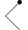
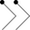
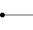
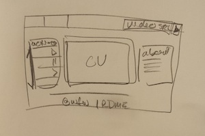
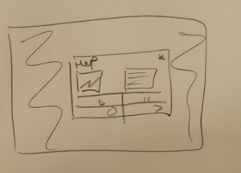

##User Interface Design (COMSW4170)
###Homework 3

---

Student Details:

- **William Falk-Wallace**
- **wgf2104**
- **wgf2104@columbia.edu**

This is my submission for Homework 3 and can be run by opening the file `index.html` in the browser.

---

###Gestures
My Gestural Video Player utilizes the following templates:

|  Command  |  Gesture  |  Original  |
|  -------  | :-------: | :--------: |
|   Play    |  |  |
|   Pause   |  |  |
| Seek Forward |  |  |
| Seek Reverse |  |  |
| Increase Playback Speed |  |  |
| Decrease Playback Speed |  |  |
| Help |  | |
| Mute On |  |  |
| Mute Off |  |  |
| Increase Volume |  |  |
| Decrease Volume |  |  |
| Increase Size |  | H/W |
| Decrease Size |  | E/I |

#####Gesture Analysis
The transition of gestures from their original to their final state of design was mostly the result of testing: some turned out to be too similar to others and some were difficult to sketch with the cursor. I ran several qualitative tests with family and friends to test the efficacy of the gestures. The most obvious result was the redesign of the pause bars and play triangle. They were combined into one, fast and simple gesture. What I found through use-case analysis and analysis of my tests, the most common action is playing, pausing, and secondarily changing the volume. 

I attempted to keep my gestures fairly skeuomorphic, particularly the forward, reverse, fast-forward (increase playback speed), reverse (decrease playback speed), and volume up and down all closely match their traditional (video player) counterparts. I also realized early on that my original concept to use letter-based gestures (upright, and on their sides) to control width and height increase and decrease (respectively) was confusing to learn or guess and difficult to get used to and draw. I changed this to a simpler, but still distinct, left and right arrow. This simplification from four to two options made sense because it is unlikely a user would intend to adjust height and width independently resulting in skew. 

The biggest adjustment was made to play and pause for two reasons, the most concrete is that the pause bars ended up being too similar in practice to the fast-forward angles, and the play triangle converged to a mute circle if the user wasn't careful. The more powerful reason though, is that, being the most frequent action, it needed a simpler gesture: the bolt toggle template is simple enough to be quickly and effectively performed with a mouse or finger but complex enough remain distinct and deliberate. 

###Design
#####P-Dollar
The use of the $P-recognizer also facilitates the goals laid out in the template choices, allowing for multiple or single strokes to complete a more meaningful and simple-to-sketch (if more visually complex) before requiring a _right_ click to finish the action, guaranteeing deliberation and unhindered playback as a result of accidental mouse action. 

#####Canvas
The design of the video player implements a nearly-full-screen canvas element for sketching gestures. This choice reflects the most common way users like to interact with video players, through global-control mechanisms: the full-size canvas allows quick and immediate control over playback. The canvas covers the full viewport except for the footer. The footer provides a safe-zone, simple to reach quickly without overshooting as well as providing access to this readme and a physical link to the help display.

#####Learning
The help section is a modal popup that offers an animation demonstrating gesture usage, a short description and the complete set of gestures and commands. It is accessible through a gesture (the up-arrow), typing the 'h' keyboard key, or the help link in the footer. The prevalence and ease of access to the help option as well as it's direct and concise simplicity is crucial to getting the new user up to speed on the application. After an initial break-in period, perhaps the splash of the help window at startup would be removed to avoid bothering the power-user.

To aid in learning as well as to clarify any errors or mis-types by the user, there is a popover dialogue in the top right of the screen, under the logo, that indicates the last recognized gesture. This is located visibly, but out of the way enough to not hinder the full functionality achievable by the experienced user. With the implementation of the popover, and to further remove impedances to viewing pleasure, the trail or path of the sketch is not drawn on screen where it might affect viewing ability, even if removed soon after - a volume change shouldn't impede the user's view of the video.

#####Process
My design process iterated through several sketches, most of which were implemented to fully visualize their potential. The following drawings illustrate the progression through different presentations of the video and help dialogues as well as canvas placement as they converged to the final product. They also illustrate the changes that were able to be made to the initial video size and video player experience as a result: the initial size is a bit larger, and the rest of the experience is uncluttered and darkly hued to make for a better, more theater-like watching experience.

